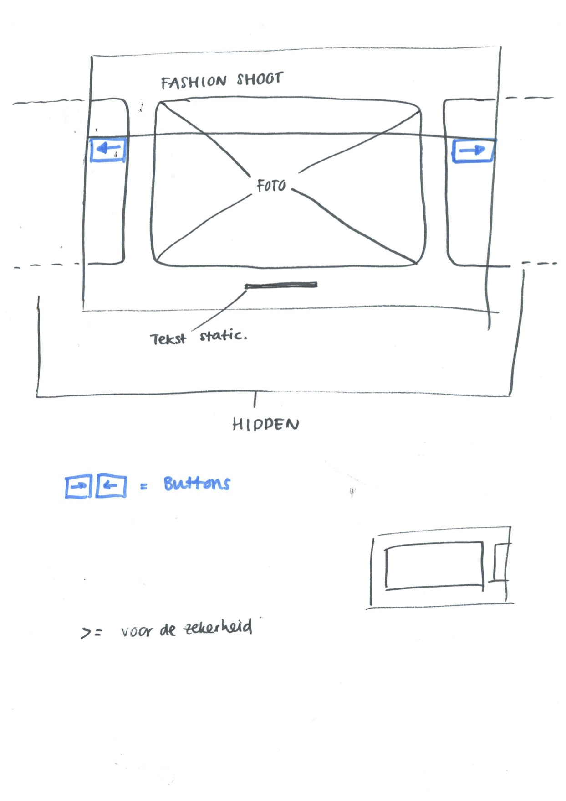

## FFD - opdracht 2

In de derde les kregen we de volgende opdracht: 
Werk een functionaliteit uit die je kan bedienen met 'click' en met minimaal één andere user interactie, zoals:

- **Het toetsenbord**

- Tap

- Dubbel Click

- Swipe

- Of een ander nuttig event

Ik heb gekozen voor de eerste Event. Hierbij maak ik gebruik van html, css en javascript om een prototype te maken.
Ik had me voorgenomen om een foto galerij te maken, een soort carousel. 

#### Werkwijze

Ik heb eerst een schets gemaakt van mijn design, echt technisch kun je hem niet noemen, maar er stond voor mij wel een aantal dingen die me gingen helpen met de code. 

Daarna heb ik het design in Sketch verder uitgewerkt. De funtie is op desktop gedesigned en uitgewerkt.

Ik heb twee versies, de eerste versie heeft geen javascript omdat ik dat niet op die manier aan de praat kreeg. 
In die versie, te vinden op https://merelvangroningen.github.io/frontend-for-designers/opdracht2/, staan de foto's naast elkaar en zie je dus ook de foto die hierna komen als je op het pijltje klikt (dit werkt dus niet).
Wat ik hier had moeten doen is in de javascript zeggen dat hij on click, zoveel pixels opzij moet verschuiven. 
Ik kreeg hier ook de CSS niet helemaal goed, wanneer je de schermresolutie aanpast werd de resolutie van de foto's misvormd. 

Toen ik merkte dat ik dit niet goed kon uitwerken, ging ik weer terug naar mijn oorspronkelijke design, dat er maar 1 foto te zien is in beeld. Mijn HTML en CSS had ik aan het begin van het coderen al zo gemaakt (en toen ging ik over op het idee hierboven), dus kon ik weer snel overschakelen. 
Alleen stonden in de code de foto's niet naast elkaar en de foto's rechts en links gehide, maar stonden de foto's over elkaar. 

#### Javacript

De uiteindelijke versie staat op https://merelvangroningen.github.io/frontend-for-designers/opdracht2-versie2/
Ik had in eerste instantie de javascript zo gemaakt dat er bij het klikken van het pijltje rechts of links de foto die nu te zien is op display none gaat en de nieuwe foto display block. Dit allemaal in de javascript zelf.
Dit heb ik in de feedback les veranderd naar een classList die wordt toevoegd in de js naar CSS, met opacity. Zo zie je een snelle overgang tussen de foto's en maak je gebruik van opmaak in de CSS. 

Bij onclick, en toestenbord rechter en linker pijltje, ga je door de lengte van een array van foto's heen en tel je bij rechts +1 (++ in de array) en naar links -1 (--) in de images.length. Er zitten nu maar 3 foto's in maar dat kan dus makkelijk aangevuld worden in de html. 
Als je eenmaal de funtie heb toegevoegd is het niet zo lastig meer om de onKeyDown toe te voegen. Daarbij heeft het mij ook wel geholpen om die dingen op te zoeken. 

#### Geleerd

Dit was al iets complexer dan de eerste opdracht. Ik heb gemerkt dat het heel handig is om goed te kunnen googlen, ook om alles te kunnen begrijpen is het goed om het zelf te schrijven. Ik begrijp nu beter hoe het werkt met een addEventListener en de classList. Er zit nu weer meer logica in voor mij, dan aan het begin van deze course. 

