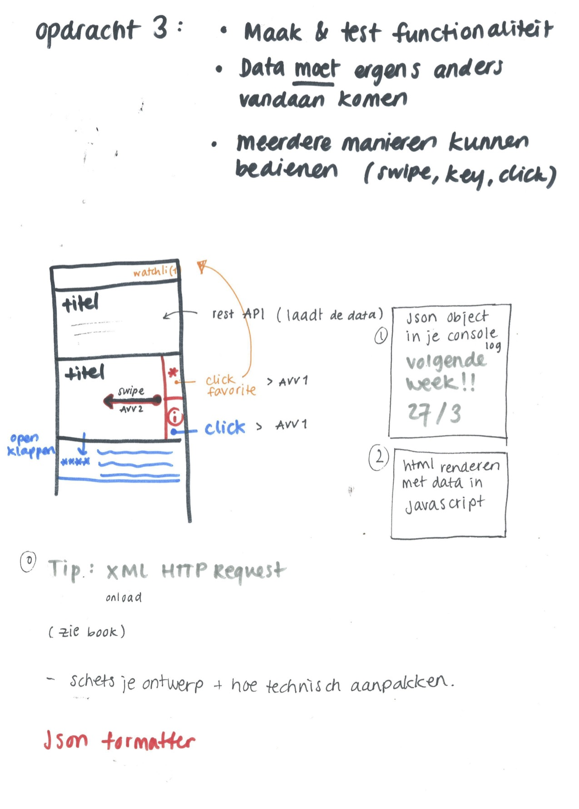

## FFD - opdracht 3

De laatste opdracht van Frontend for Designers bestond uit de volgende dingen (zie afbeelding hieronder):


Ik heb ervoor gekozen om mijn werk uit opdracht 1 te veranderen en te verbeteren. 

#### Werkwijze !

Ik heb eerst een schets gemaakt van mijn design, echt technisch kun je hem niet noemen, maar er stond voor mij wel een aantal dingen die me gingen helpen met de code. 
[schets behorend bij opdracht 3](pictures/schetsopdracht-3.png "schets behorend bij opdracht 3")


Ik ben gaan kijken wat ik anders wilde in vegelijking tot mijn eerste opdracht. Ik wilde de afbeeldingen van de films groter maken zodat de informatietekst die later uitklapt er netjes onder kon komen te staan in het midden van de gehele pagina. Daarnaast wilde ik ook dat je meer animatie kreeg bij het selecteren van het hartje en dat er meer feedback was voor de gebruiker dat de film ook was toegevoegd aan de watchlist. Ook heb ik een transition toegevoegd wanneer je over een cover hovert. De data heb ik uit een filmdatabase gehaald: Film database(je) - http://dennistel.nl/movies. Op github gezet als movies.json. 


#### Javacript

Naast de gewoonlijke click event heb ik ook nog steeds de mogelijkheid om te verticaal scrollen door de filmlijst en je kunt er door heen met de pijltjes toetsen. De uiteindelijke versie staat [op merelvangroningen.github.io](https://merelvangroningen.github.io/frontend-for-designers/opdracht3/).
De javascript om de date vanuit een datebase te halen was als je het eenmaal doorhebt goed te doen

```javascript
var xmlHttpReq = new XMLHttpRequest();

xmlHttpReq.addEventListener("load", reqListener);
xmlHttpReq.open("GET", "https://merelvangroningen.github.io/frontend-for-designers/opdracht3/movies.json"); //  GET haalt iets van de site af
xmlHttpReq.send();

function reqListener () {
  var json_data = JSON.parse(this.responseText);
  console.log(json_data);

  json_data.forEach(function(obj) {
    console.log(obj);
    var ul = document.getElementById("movie_list");
    var li = document.createElement("li");
    var a = document.createElement("a");
    li.appendChild(a);

    var img_heart = document.createElement("img");
    img_heart.src = "img/heartwhite.png";
    img_heart.classList.add("heart");
    a.appendChild(img_heart);

    var img_2 = document.createElement("img");
    img_2.src = obj.cover;
    img_2.classList.add("cover");
    a.appendChild(img_2);
```


#### Geleerd

Deze opdracht was wel een uitdaging, zo is het bijvoorbeeld na proberen niet gelukt om een mooie transitie te doen met het doorklikken naar de volgende film. 

```javascript
function nextCover() {
  var container = document.getElementById('scroll_container');
  container.scrollLeft += 350;
}
function previousCover() {
  var container = document.getElementById('scroll_container');
  container.scrollLeft -= 350;
}

var nextButton = document.querySelector('.arrowRight')
nextButton.addEventListener('click', function(){
  nextCover();
});

var previousButton = document.querySelector('.arrowLeft')
previousButton.addEventListener('click', function(){
  previousCover();
});

document.onkeydown = function() {
    switch (window.event.keyCode) {
        case 37:
        previousCover();
         break;
        case 39:
        nextCover();
         break;
    }
};
```
Ik heb geprobeerd om gebruik te maken van transform: translate(x), maar kreeg het hiermee niet aan de praat. Ook heb ik gekeken naar behavior: 'smooth', maar ook dat werkte niet op mijn code. Ik kon het verder niet vinden op internet, dus ik heb het hierbij gelaten. 

