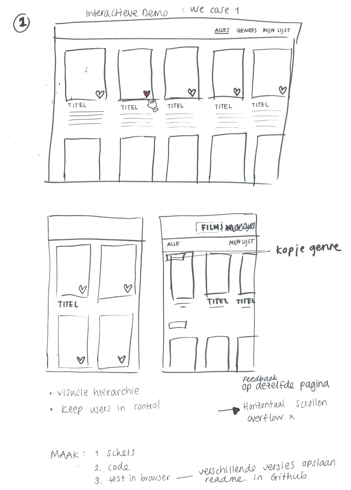
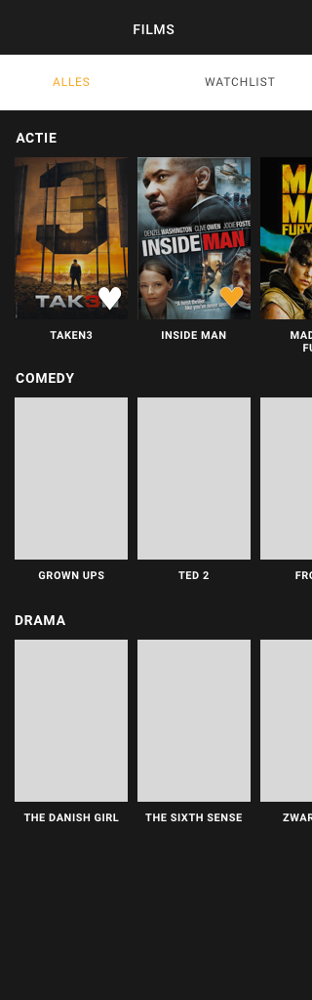

## FFD - opdracht 1

In de eerste les kregen we de keuze uit 4 usecases om uit te werken tot een prototype: 

- **Als ik een lijst films heb gevonden, wil ik leuke films kunnen opslaan om ze thuis te ....**

- In een lijst gevonden studentenhuizen wil ik details kunnen bekijken om te bepalen of de kamer geschikt is.

- In een verzameling muzieknummers wil ik de volgorde kunnen veranderen om een vette playlist te maken.

- Als ik foto's zoek wil ik kunnen selecteren op kleur om verassende zoekresultaten te krijgen.

Ik heb gekozen voor de eerste use case. Hierbij maak ik gebruik van html, css en javascript om een prototype te maken.

#### Hoe werkt het?

Allereerst ben ik gaan schetsen hoe mijn lijst met films eruit moest komen te zien. Daarna heb ik het design in Sketch verder uitgewerkt. De funtie is optimaal uitgewerkt voor mobile en werkt responsive (met meerdere films in de code ziet hij er beter uit op desktop).

Bovenin het scherm staat de titel, films, deze wordt gevolgd door het "menu" (in html) die de kopjes 'ALLES' en 'WATCHLIST' bevat. Alles is de pagina waar je binnenkomt, met alle films verdeeld in genres. Watchlist is waar de gebruiker de films zou moeten kunnen opslaan en terugvinden. Het daadwerkelijke opslaan is niet uitgewerkt maar wel de actie zodat de gebruiker de interactie kan uitvoeren om een film te liken en de feedback die de gebruiker krijg wanneer hij een film heeft geliked. 
In het gemaakte prototype staan op het moment 3 film genres die elk 5 films bevatten. Hier kunnen meer genres en meer films worden toegevoegd. In elk genre kan de gebruiker horizontaal door de films scrollen (gemaakt in css). 

#### Afbeeldingen plaatsen

Ik dacht eerst dat ik elk kopje voor een filmgenre kon volgen met een pharagraph met albeeldingen erin, maar zag al snel dat dit niet werkte zoals ik wilde.

Het dit toen met een unordered list opgevangen in een div. Hierdoor kon ik het anders aanroepen in CSS, waardoor het scrollen mogelijk werd, met behulp van http://www.websitecodetutorials.com/.

Ook wat kleine aanpassingen in lettertypen groottes voor goede hierarchie, kloppend bij het design.

#### Javacript

Wanneer je op het witte hartje klikt, like je de film en veranderd het hartje naar oranje/rood. Ook zie je bij de tekst Watchlist(0), de '0' veranderen naar een 1 en als je er nog een hartje aanklikt veranderd hij naar 2 enz. Hij telt ook af wanneer je het oranje/rood hartje aanklikt dan unlike je hem. 
Dit is gemaakt met een variabel watchlist_total die op 0 staat bij binnenkomst van de pagina en alle hartjes staan op wit. Wanneer (if) het hartje rood is dan moet hij onclick wit worden en -1 (--) doen in de watchlist, anders (else) onclick het hartje nog rood maken en 1 optellen bij het aantal in de watchlist. 

Ik heb forEach gebruikt om dit te laten werken bij elk hartje dat je tegen komt in de code. hij pakt hier in de fuctie alle elementen uit de array (je loopt door elke image heen en voegt overal apart die addEventListener toe).

#### Geleerd

Ik stond er van te kijken dat ik mijn design uit Sketch precies zo heb kunnen bouwen in html en CSS. Ik ben geen held met coderen, en dit was dan ook zeker een prestatie. Mijn javascript was wel echt flink weggezakt dus ik moest echt weer even in de stof duiken om de code te begrijpen, waar alle haakjes en ; moeten komen te staan. Dit was nog goed te begrijpen code en heb aardig wat stappen en manieren doorlopen om het zo werkend te krijgen. 
Vooral als ik er op terug kijk is dit redelijk simpel en hebben we bij opdracht 3 meer uitgepakt, vooral ook door de data die je ergens anders vandaan haalt. Leuke toevoeging en ook goed te doen als je het eenmaal doorhebt. 

